```mermaid
flowchart TB
    subgraph current["InquirySpark.Admin.csproj"]
        MAIN["<b>📦&nbsp;InquirySpark.Admin.csproj</b><br/><small>net8.0</small>"]
        click MAIN "#inquirysparkadmininquirysparkadmincsproj"
    end
    subgraph downstream["Dependencies (1"]
        P1["<b>📦&nbsp;InquirySpark.Repository.csproj</b><br/><small>net8.0</small>"]
        click P1 "#inquirysparkrepositoryinquirysparkrepositorycsproj"
    end
    MAIN --> P1

```

```mermaid
flowchart TB
    subgraph current["InquirySpark.Common.Tests.csproj"]
        MAIN["<b>📦&nbsp;InquirySpark.Common.Tests.csproj</b><br/><small>net8.0</small>"]
        click MAIN "#inquirysparkcommontestsinquirysparkcommontestscsproj"
    end
    subgraph downstream["Dependencies (1"]
        P2["<b>📦&nbsp;InquirySpark.Common.csproj</b><br/><small>net8.0</small>"]
        click P2 "#inquirysparkcommoninquirysparkcommoncsproj"
    end
    MAIN --> P2

```

```mermaid
flowchart TB
    subgraph upstream["Dependants (3)"]
        P1["<b>📦&nbsp;InquirySpark.Repository.csproj</b><br/><small>net8.0</small>"]
        P3["<b>📦&nbsp;InquirySpark.WebApi.csproj</b><br/><small>net8.0</small>"]
        P4["<b>📦&nbsp;InquirySpark.Common.Tests.csproj</b><br/><small>net8.0</small>"]
        click P1 "#inquirysparkrepositoryinquirysparkrepositorycsproj"
        click P3 "#inquirysparkwebapiinquirysparkwebapicsproj"
        click P4 "#inquirysparkcommontestsinquirysparkcommontestscsproj"
    end
    subgraph current["InquirySpark.Common.csproj"]
        MAIN["<b>📦&nbsp;InquirySpark.Common.csproj</b><br/><small>net8.0</small>"]
        click MAIN "#inquirysparkcommoninquirysparkcommoncsproj"
    end
    P1 --> MAIN
    P3 --> MAIN
    P4 --> MAIN

```

```mermaid
flowchart TB
    subgraph upstream["Dependants (2)"]
        P3["<b>📦&nbsp;InquirySpark.WebApi.csproj</b><br/><small>net8.0</small>"]
        P6["<b>📦&nbsp;InquirySpark.Admin.csproj</b><br/><small>net8.0</small>"]
        click P3 "#inquirysparkwebapiinquirysparkwebapicsproj"
        click P6 "#inquirysparkadmininquirysparkadmincsproj"
    end
    subgraph current["InquirySpark.Repository.csproj"]
        MAIN["<b>📦&nbsp;InquirySpark.Repository.csproj</b><br/><small>net8.0</small>"]
        click MAIN "#inquirysparkrepositoryinquirysparkrepositorycsproj"
    end
    subgraph downstream["Dependencies (1"]
        P2["<b>📦&nbsp;InquirySpark.Common.csproj</b><br/><small>net8.0</small>"]
        click P2 "#inquirysparkcommoninquirysparkcommoncsproj"
    end
    P3 --> MAIN
    P6 --> MAIN
    MAIN --> P2

```

```mermaid
flowchart TB
    subgraph current["InquirySpark.Web.csproj"]
        MAIN["<b>📦&nbsp;InquirySpark.Web.csproj</b><br/><small>net8.0</small>"]
        click MAIN "#inquirysparkwebinquirysparkwebcsproj"
    end

```

```mermaid
flowchart TB
    subgraph current["InquirySpark.WebApi.csproj"]
        MAIN["<b>📦&nbsp;InquirySpark.WebApi.csproj</b><br/><small>net8.0</small>"]
        click MAIN "#inquirysparkwebapiinquirysparkwebapicsproj"
    end
    subgraph downstream["Dependencies (2"]
        P1["<b>📦&nbsp;InquirySpark.Repository.csproj</b><br/><small>net8.0</small>"]
        P2["<b>📦&nbsp;InquirySpark.Common.csproj</b><br/><small>net8.0</small>"]
        click P1 "#inquirysparkrepositoryinquirysparkrepositorycsproj"
        click P2 "#inquirysparkcommoninquirysparkcommoncsproj"
    end
    MAIN --> P1
    MAIN --> P2

```

# Projects and dependencies analysis

This document provides a comprehensive overview of the projects and their dependencies in the context of upgrading to .NET 10.0.

## User Decision

**Security Vulnerabilities**: User has confirmed that security fixes should be **included as part of this upgrade**.
- Azure.Identity package will be upgraded from 1.10.4 to 1.17.1 in affected projects (InquirySpark.Admin and InquirySpark.Web)

## Table of Contents

- [Projects Relationship Graph](#projects-relationship-graph)
- [Project Details](#project-details)

  - [InquirySpark.Admin\InquirySpark.Admin.csproj](#inquirysparkadmininquirysparkadmincsproj)
  - [InquirySpark.Common.Tests\InquirySpark.Common.Tests.csproj](#inquirysparkcommontestsinquirysparkcommontestscsproj)
  - [InquirySpark.Common\InquirySpark.Common.csproj](#inquirysparkcommoninquirysparkcommoncsproj)
  - [InquirySpark.Repository\InquirySpark.Repository.csproj](#inquirysparkrepositoryinquirysparkrepositorycsproj)
  - [InquirySpark.Web\InquirySpark.Web.csproj](#inquirysparkwebinquirysparkwebcsproj)
  - [InquirySpark.WebApi\InquirySpark.WebApi.csproj](#inquirysparkwebapiinquirysparkwebapicsproj)
- [Aggregate NuGet packages details](#aggregate-nuget-packages-details)

## Projects Relationship Graph

Legend:
📦 SDK-style project
⚙️ Classic project

## Project Details

### InquirySpark.Admin\InquirySpark.Admin.csproj

#### Project Info

- **Current Target Framework:** net8.0
- **Proposed Target Framework:** net10.0
- **SDK-style**: True
- **Project Kind:** AspNetCore
- **Dependencies**: 1
- **Dependants**: 0
- **Number of Files**: 278
- **Lines of Code**: 18974

#### Dependency Graph

Legend:
📦 SDK-style project
⚙️ Classic project

#### Project Package References

| Package | Type | Current Version | Suggested Version | Description |
| :--- | :---: | :---: | :---: | :--- |
| Azure.Identity | Explicit | 1.10.4 | 1.17.1 | NuGet package contains security vulnerability |
| Microsoft.AspNetCore.Components.QuickGrid.EntityFrameworkAdapter | Explicit | 8.0.3 | 10.0.0 | NuGet package upgrade is recommended |
| Microsoft.AspNetCore.Identity.EntityFrameworkCore | Explicit | 8.0.3 | 10.0.0 | NuGet package upgrade is recommended |
| Microsoft.AspNetCore.Identity.UI | Explicit | 8.0.3 | 10.0.0 | NuGet package upgrade is recommended |
| Microsoft.EntityFrameworkCore.Sqlite | Explicit | 8.0.3 | 10.0.0 | NuGet package upgrade is recommended |
| Microsoft.EntityFrameworkCore.SqlServer | Explicit | 8.0.3 | 10.0.0 | NuGet package upgrade is recommended |
| Microsoft.EntityFrameworkCore.Tools | Explicit | 8.0.3 | 10.0.0 | NuGet package upgrade is recommended |
| Microsoft.VisualStudio.Web.CodeGeneration.Design | Explicit | 8.0.2 | 10.0.0-rc.1.25458.5 | NuGet package upgrade is recommended |

### InquirySpark.Common.Tests\InquirySpark.Common.Tests.csproj

#### Project Info

- **Current Target Framework:** net8.0
- **Proposed Target Framework:** net10.0
- **SDK-style**: True
- **Project Kind:** DotNetCoreApp
- **Dependencies**: 1
- **Dependants**: 0
- **Number of Files**: 9
- **Lines of Code**: 495

#### Dependency Graph

Legend:
📦 SDK-style project
⚙️ Classic project

#### Project Package References

| Package | Type | Current Version | Suggested Version | Description |
| :--- | :---: | :---: | :---: | :--- |
| Microsoft.Extensions.Configuration.UserSecrets | Explicit | 8.0.0 | 10.0.0 | NuGet package upgrade is recommended |
| Microsoft.NET.Test.Sdk | Explicit | 17.9.0 |  | ✅Compatible |
| MSTest.TestAdapter | Explicit | 3.2.2 |  | ✅Compatible |
| MSTest.TestFramework | Explicit | 3.2.2 |  | ✅Compatible |

### InquirySpark.Common\InquirySpark.Common.csproj

#### Project Info

- **Current Target Framework:** net8.0
- **Proposed Target Framework:** net10.0
- **SDK-style**: True
- **Project Kind:** ClassLibrary
- **Dependencies**: 0
- **Dependants**: 3
- **Number of Files**: 48
- **Lines of Code**: 1653

#### Dependency Graph

Legend:
📦 SDK-style project
⚙️ Classic project

#### Project Package References

| Package | Type | Current Version | Suggested Version | Description |
| :--- | :---: | :---: | :---: | :--- |
| Microsoft.Extensions.Configuration.UserSecrets | Explicit | 8.0.0 | 10.0.0 | NuGet package upgrade is recommended |

### InquirySpark.Repository\InquirySpark.Repository.csproj

#### Project Info

- **Current Target Framework:** net8.0
- **Proposed Target Framework:** net10.0
- **SDK-style**: True
- **Project Kind:** ClassLibrary
- **Dependencies**: 1
- **Dependants**: 2
- **Number of Files**: 56
- **Lines of Code**: 6703

#### Dependency Graph

Legend:
📦 SDK-style project
⚙️ Classic project

#### Project Package References

| Package | Type | Current Version | Suggested Version | Description |
| :--- | :---: | :---: | :---: | :--- |
| Microsoft.EntityFrameworkCore | Explicit | 8.0.3 | 10.0.0 | NuGet package upgrade is recommended |
| Microsoft.EntityFrameworkCore.Design | Explicit | 8.0.3 | 10.0.0 | NuGet package upgrade is recommended |
| Microsoft.EntityFrameworkCore.SqlServer | Explicit | 8.0.3 | 10.0.0 | NuGet package upgrade is recommended |
| Microsoft.EntityFrameworkCore.Tools | Explicit | 8.0.3 | 10.0.0 | NuGet package upgrade is recommended |
| Microsoft.Extensions.Configuration.UserSecrets | Explicit | 8.0.0 | 10.0.0 | NuGet package upgrade is recommended |
| Microsoft.VisualStudio.Azure.Containers.Tools.Targets | Explicit | 1.19.6 |  | ⚠️NuGet package is incompatible |

### InquirySpark.Web\InquirySpark.Web.csproj

#### Project Info

- **Current Target Framework:** net8.0
- **Proposed Target Framework:** net10.0
- **SDK-style**: True
- **Project Kind:** AspNetCore
- **Dependencies**: 0
- **Dependants**: 0
- **Number of Files**: 23
- **Lines of Code**: 3813

#### Dependency Graph

Legend:
📦 SDK-style project
⚙️ Classic project

#### Project Package References

| Package | Type | Current Version | Suggested Version | Description |
| :--- | :---: | :---: | :---: | :--- |
| Azure.Identity | Explicit | 1.10.4 | 1.17.1 | NuGet package contains security vulnerability |
| Microsoft.AspNetCore.Diagnostics.EntityFrameworkCore | Explicit | 8.0.3 | 10.0.0 | NuGet package upgrade is recommended |
| Microsoft.AspNetCore.Identity.EntityFrameworkCore | Explicit | 8.0.3 | 10.0.0 | NuGet package upgrade is recommended |
| Microsoft.AspNetCore.Identity.UI | Explicit | 8.0.3 | 10.0.0 | NuGet package upgrade is recommended |
| Microsoft.EntityFrameworkCore.SqlServer | Explicit | 8.0.3 | 10.0.0 | NuGet package upgrade is recommended |
| Microsoft.EntityFrameworkCore.Tools | Explicit | 8.0.3 | 10.0.0 | NuGet package upgrade is recommended |
| Microsoft.VisualStudio.Azure.Containers.Tools.Targets | Explicit | 1.19.6 |  | ⚠️NuGet package is incompatible |
| Newtonsoft.Json | Explicit | 13.0.3 | 13.0.4 | NuGet package upgrade is recommended |

### InquirySpark.WebApi\InquirySpark.WebApi.csproj

#### Project Info

- **Current Target Framework:** net8.0
- **Proposed Target Framework:** net10.0
- **SDK-style**: True
- **Project Kind:** AspNetCore
- **Dependencies**: 2
- **Dependants**: 0
- **Number of Files**: 9
- **Lines of Code**: 356

#### Dependency Graph

Legend:
📦 SDK-style project
⚙️ Classic project

#### Project Package References

| Package | Type | Current Version | Suggested Version | Description |
| :--- | :---: | :---: | :---: | :--- |
| Microsoft.EntityFrameworkCore.Tools | Explicit | 8.0.3 | 10.0.0 | NuGet package upgrade is recommended |
| Microsoft.VisualStudio.Azure.Containers.Tools.Targets | Explicit | 1.19.6 |  | ⚠️NuGet package is incompatible |
| Swashbuckle.AspNetCore | Explicit | 6.5.0 |  | ✅Compatible |
| Swashbuckle.AspNetCore.Annotations | Explicit | 6.5.0 |  | ✅Compatible |
| Swashbuckle.AspNetCore.SwaggerUI | Explicit | 6.5.0 |  | ✅Compatible |

## Aggregate NuGet packages details

| Package | Current Version | Suggested Version | Projects | Description |
| :--- | :---: | :---: | :--- | :--- |
| Azure.Identity | 1.10.4 | 1.17.1 | [InquirySpark.Admin.csproj](#inquirysparkadmincsproj) [InquirySpark.Web.csproj](#inquirysparkwebcsproj) | NuGet package contains security vulnerability |
| Microsoft.AspNetCore.Components.QuickGrid.EntityFrameworkAdapter | 8.0.3 | 10.0.0 | [InquirySpark.Admin.csproj](#inquirysparkadmincsproj) | NuGet package upgrade is recommended |
| Microsoft.AspNetCore.Diagnostics.EntityFrameworkCore | 8.0.3 | 10.0.0 | [InquirySpark.Web.csproj](#inquirysparkwebcsproj) | NuGet package upgrade is recommended |
| Microsoft.AspNetCore.Identity.EntityFrameworkCore | 8.0.3 | 10.0.0 | [InquirySpark.Admin.csproj](#inquirysparkadmincsproj) [InquirySpark.Web.csproj](#inquirysparkwebcsproj) | NuGet package upgrade is recommended |
| Microsoft.AspNetCore.Identity.UI | 8.0.3 | 10.0.0 | [InquirySpark.Admin.csproj](#inquirysparkadmincsproj) [InquirySpark.Web.csproj](#inquirysparkwebcsproj) | NuGet package upgrade is recommended |
| Microsoft.EntityFrameworkCore | 8.0.3 | 10.0.0 | [InquirySpark.Repository.csproj](#inquirysparkrepositorycsproj) | NuGet package upgrade is recommended |
| Microsoft.EntityFrameworkCore.Design | 8.0.3 | 10.0.0 | [InquirySpark.Repository.csproj](#inquirysparkrepositorycsproj) | NuGet package upgrade is recommended |
| Microsoft.EntityFrameworkCore.Sqlite | 8.0.3 | 10.0.0 | [InquirySpark.Admin.csproj](#inquirysparkadmincsproj) | NuGet package upgrade is recommended |
| Microsoft.EntityFrameworkCore.SqlServer | 8.0.3 | 10.0.0 | [InquirySpark.Admin.csproj](#inquirysparkadmincsproj) [InquirySpark.Repository.csproj](#inquirysparkrepositorycsproj) [InquirySpark.Web.csproj](#inquirysparkwebcsproj) | NuGet package upgrade is recommended |
| Microsoft.EntityFrameworkCore.Tools | 8.0.3 | 10.0.0 | [InquirySpark.Admin.csproj](#inquirysparkadmincsproj) [InquirySpark.Repository.csproj](#inquirysparkrepositorycsproj) [InquirySpark.Web.csproj](#inquirysparkwebcsproj) [InquirySpark.WebApi.csproj](#inquirysparkwebapicsproj) | NuGet package upgrade is recommended |
| Microsoft.Extensions.Configuration.UserSecrets | 8.0.0 | 10.0.0 | [InquirySpark.Common.Tests.csproj](#inquirysparkcommontestscsproj) [InquirySpark.Common.csproj](#inquirysparkcommoncsproj) [InquirySpark.Repository.csproj](#inquirysparkrepositorycsproj) | NuGet package upgrade is recommended |
| Microsoft.NET.Test.Sdk | 17.9.0 |  | [InquirySpark.Common.Tests.csproj](#inquirysparkcommontestscsproj) | ✅Compatible |
| Microsoft.VisualStudio.Azure.Containers.Tools.Targets | 1.19.6 |  | [InquirySpark.Repository.csproj](#inquirysparkrepositorycsproj) [InquirySpark.Web.csproj](#inquirysparkwebcsproj) [InquirySpark.WebApi.csproj](#inquirysparkwebapicsproj) | ⚠️NuGet package is incompatible |
| Microsoft.VisualStudio.Web.CodeGeneration.Design | 8.0.2 | 10.0.0-rc.1.25458.5 | [InquirySpark.Admin.csproj](#inquirysparkadmincsproj) | NuGet package upgrade is recommended |
| MSTest.TestAdapter | 3.2.2 |  | [InquirySpark.Common.Tests.csproj](#inquirysparkcommontestscsproj) | ✅Compatible |
| MSTest.TestFramework | 3.2.2 |  | [InquirySpark.Common.Tests.csproj](#inquirysparkcommontestscsproj) | ✅Compatible |
| Newtonsoft.Json | 13.0.3 | 13.0.4 | [InquirySpark.Web.csproj](#inquirysparkwebcsproj) | NuGet package upgrade is recommended |
| Swashbuckle.AspNetCore | 6.5.0 |  | [InquirySpark.WebApi.csproj](#inquirysparkwebapicsproj) | ✅Compatible |
| Swashbuckle.AspNetCore.Annotations | 6.5.0 |  | [InquirySpark.WebApi.csproj](#inquirysparkwebapicsproj) | ✅Compatible |
| Swashbuckle.AspNetCore.SwaggerUI | 6.5.0 |  | [InquirySpark.WebApi.csproj](#inquirysparkwebapicsproj) | ✅Compatible |

